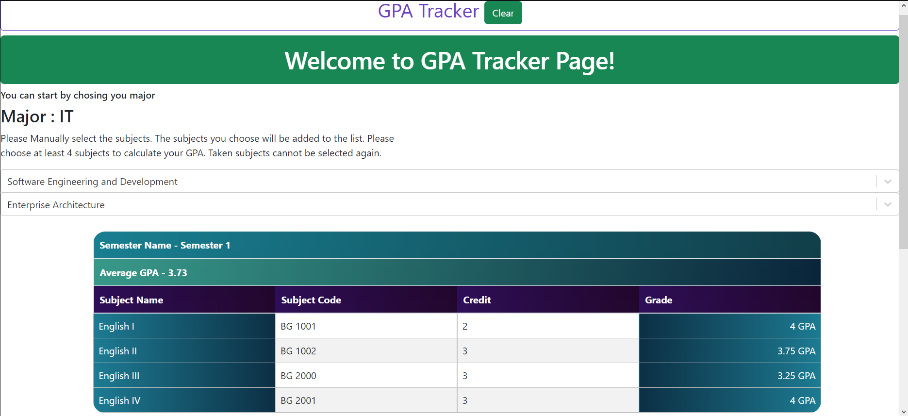
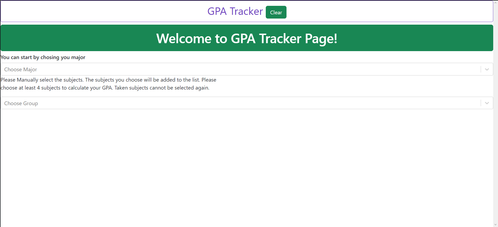
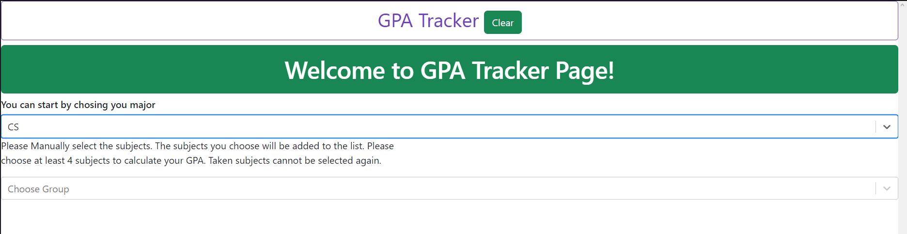
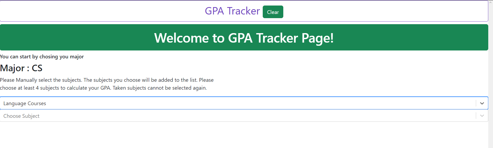
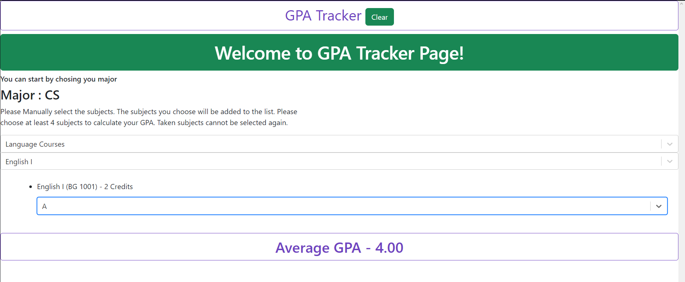
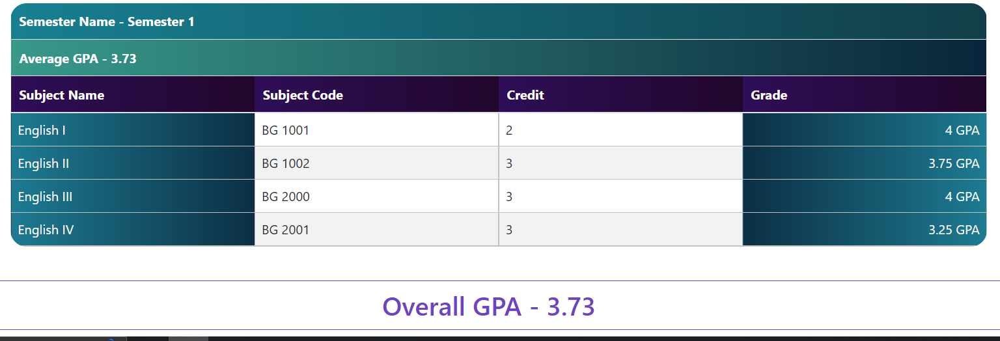
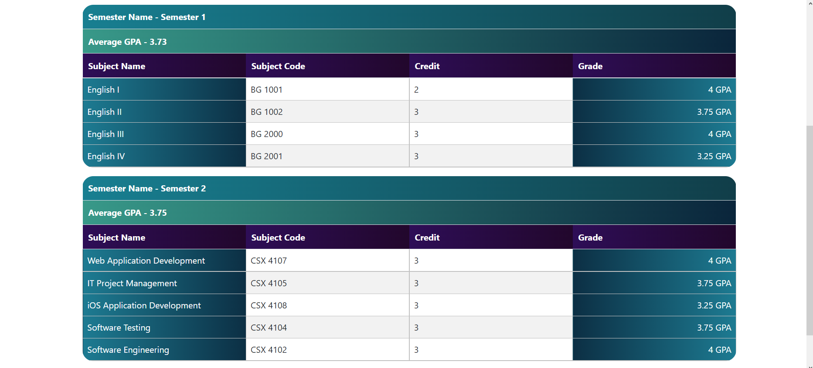
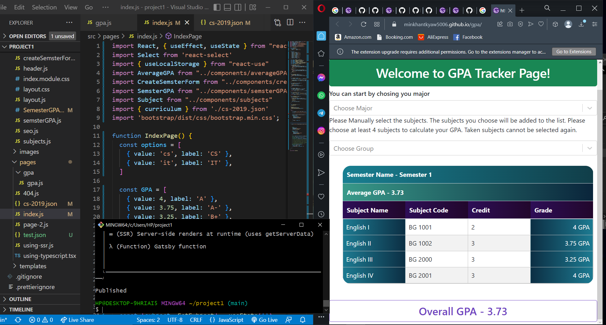

<!-- AUTO-GENERATED-CONTENT:START (STARTER) -->

  

<h1 align="center">
  Min Khant Kyaw's GPA TRACKER
</h1>

This is a web dev project 'gpatracker' used gatsby.

## 🚀 Project Description

1.  **Project Name**

     The name of the project is simply 'gpa tracker' created as a web dev project 1.
     

1.  **Author**

     This project is aurthorized by Min Khant Kyaw , 6410935, junior web developer. This project is written using approximately 8 days.

1.  **Project Description**

    The website introduce users a system to calculate their grade average point of each every semester and overall gpa. 
    
    

     Users will first select their majors CS or IT.
     
     
     
     Secondly, they will select group courses to focus on the specific subjects. example, Language courses, core courses, general courses
     
     
    
     And then, They can choose a subject and it will be automatically added to the list
     
     
     
     After choosing one subject, a dropdown bar for grade selection will appear and users can give inputs.
     
     
     
     Finally, after adding minimum 4 subjects, maximum 7 subjects, user can create a table and give names.
     a colored glazing desgined table will appear and the webiste will store users' grades.
     
     
     
     Users can add multiple tables to calculate overall GPA from them as well as get the table back when refreshed the webpage
     
     
   
1.  **Features**

     After adding at least 4 subjects, users can add their grades and click createsemester button. This function will create a semester table with the user's give name.

     Users can refresh the webpage again and can still see the table they created. To clear all the data, they can simply click clear beside the GPA Tracker title.

1.  **Techstack**

     1. Useeffect, UseState, Uselocal storage are used for storing and passing data

     2. Gatsby framework for deployment

     3. Index will be routed as the main file while other serves as components
     
     4. npm install react-bootstrap bootstracp
     
     
     

<!-- AUTO-GENERATED-CONTENT:END -->

